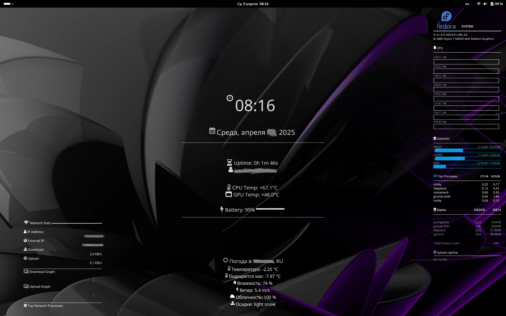

#My conky config 

## Node: Fedora
## Laptop: Redmibook Pro 15S

Install: 
1. Install conky; lm-sensors
2. Clone repository;
3. weather.conf: Replace [OpenweatherAPI] with you API; enter your city
4. network.conf: Replace wlp1s0;

Screenshot:

Original conky config:
https://github.com/monkey-d-luffy-102016/conky_config/archive/refs/heads/main.zip
